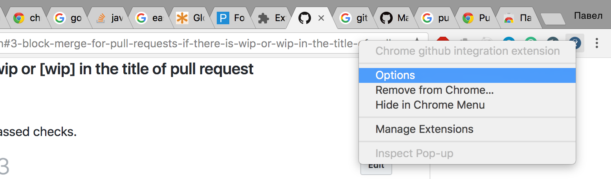
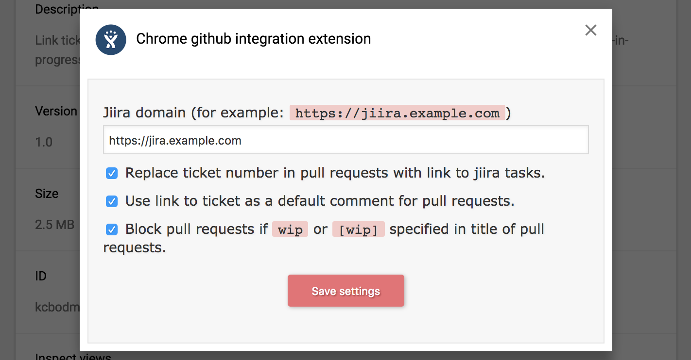
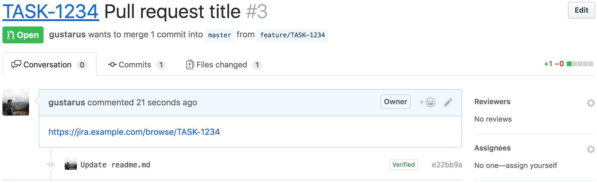
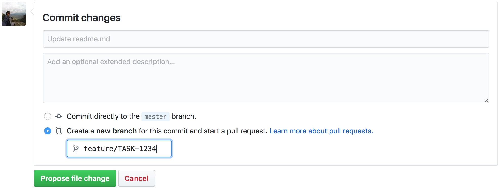
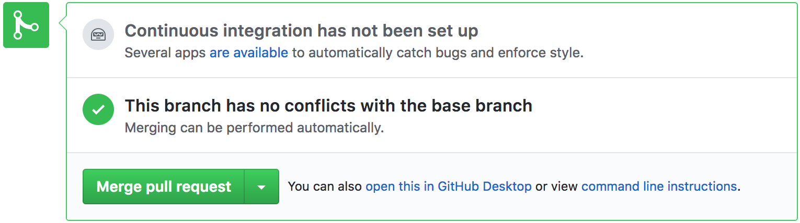
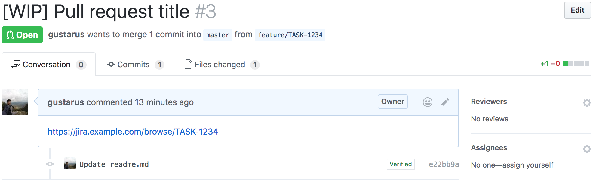
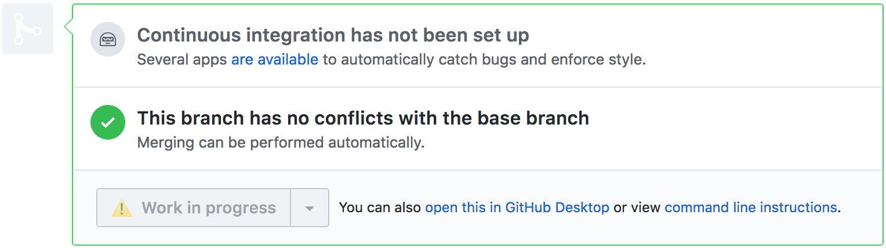

# Chrme extensions for github integration&nbsp;&nbsp; 
The following settings are available in this extension:
1. [Replace tickets numbers in pull requests with links to jiira tasks](#1-replace-tickets-numbers-in-pull-requests-with-links-to-jiira-tasks).
2. [Add link to jiira task for every comment in pull requests](#2-add-link-to-jiira-task-for-every-comment-in-pull-requests).
3. [Block merge for pull requests if there is wip or \[wip\] in the title of pull request](#3-block-merge-for-pull-requests-if-there-is-wip-or-wip-in-the-title-of-pull-request).

## Install the extension
- [ ] Install from chrome extensions store.
- [x] [#install-from-an-archive](Install from an archive).

## Install from an archive
### 1. Download an archive from github: (download)[/gustarus/chrome-github-integration-extension/archive/master.zip]
Unzip this archive.

### 2. Go to `chrome://extensions` tab and enable developer mode
Or `Menu` --> `More tools` --> `Extensions`.
The checkbox `developer mode` will be in the top-right corner of the tab.

### 3. Click `Load unpacked`
And select unziped archive.
Click `select` and now you have working version of the package!

## Change the extension options
### a. Install the extension

### b. Go to options

Right click on the icon of the extension in the bar.

<kbd>
  
</kbd>

### c. Set your options

Jiira host is required.

<kbd>
  
</kbd>

## Functionality
### 1. Replace tickets numbers in pull requests with links to jiira tasks
#### a. Create a pull request

Imagine that we already have a pull request.

<kbd>
  
</kbd>

#### b. Add ticket number to the comment

Let's add ticket number, for example: `TASK-1234`.
*You can take ticket number from link to the task: https://jira.example.com/browse/`TASK-1234`.*
Now we have ticket title with ticket number which is a link to the ticket in jiira.

<kbd>
  
</kbd>

### 2. Add link to jiira task for every comment in pull requests
#### a. Create a branch with ticket number

In this example it's a `feature/TASK-1234`.

<kbd>
  
</kbd>

#### b. Create a pull request for the branch with ticket number

Imagine that me made some changes and pushed the branch. Now we are going to create a pull request.
The link to the ticket will be set to the comment window and you can change it if you want.  

<kbd>
  
</kbd>

#### c. See the link to the ticket in the comment

Now we have a pull request with link to the ticket.

<kbd>
  
</kbd>

### 3. Block merge for pull requests if there is wip or \[wip\] in the title of pull request
#### a. Create a pull request

Imagine that we already have a pull request with all passed checks.

<kbd>
  
</kbd>

Also we have an enabled button for this merge request.

<kbd>
  
</kbd>

#### b. Add wip flag to the comment

Let's add `[WIP]` flag (also available: `wip`, `[wip]`, `WIP`).

<kbd>
  
</kbd>

Now the button is blocked.

<kbd>
  
</kbd>

