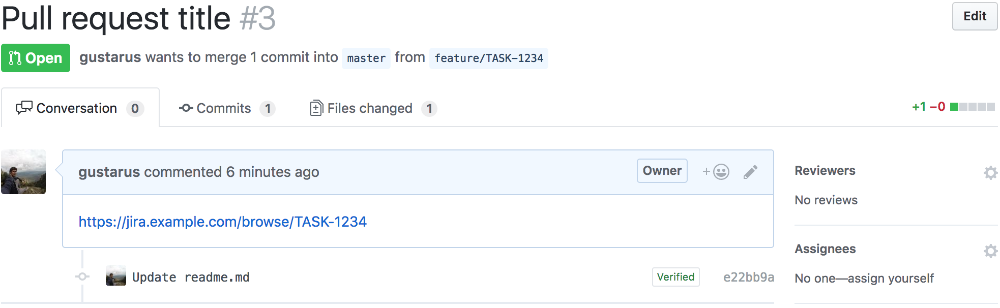
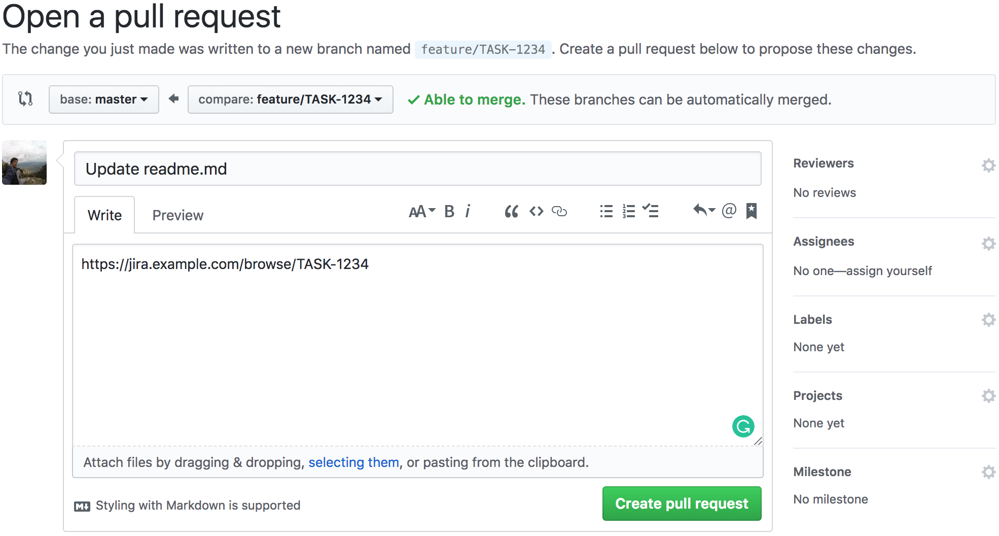

# Chrome extensions for github integration
### 1. Replace tickets numbers in pull requests with links to jiira tasks
**1. Create a pull request***
Imagine that we already have a pull request.

**2. Add ticket number to the comment**
Let's add ticket number, for example: `TASK-1234`.
*You can take ticket number from link to the task: https://jira.example.com/browse/`TASK-1234`.*
Now we have ticket title with ticket number which is a link to the ticket in jiira.

### 2. Add link to jiira task for every comment in pull requests
**1. Create a branch with ticket number**
In this example it's a `feature/TASK-1234`.

**2. Create a pull request for the branch with ticket number**
Imagine that me made some changes and pushed the branch. Now we are going to create a pull request.
The link to the ticket will be set to the comment window and you can change it if you want.  

**3. See the link to the ticket in the comment**
Now we have a pull request with link to the ticket.

### 3. Block merge for pull requests if there is wip or \[wip\] in the title of pull request
**1. Create a pull request***
Imagine that we already have a pull request with all passed checks.

Also we have an enabled button for this merge request.

**3. Add wip flag to the comment**
Let's add `[WIP]` flag (also available: `wip`, `[wip]`, `WIP`).

Now the button is blocked.

